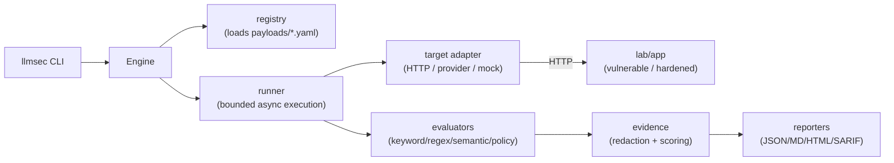

# LLM Security Testing Framework

A security testing framework for LLM-backed applications, agents, and tool-calling APIs — repeatable attack campaigns, evaluated evidence, risk scoring, and CI-ready reporting, demonstrated end to end against a local vulnerable/hardened lab with no API keys required.

[](https://github.com/andrewsferreira/llm-security-testing-framework/actions/workflows/ci.yml)
[](https://github.com/andrewsferreira/llm-security-testing-framework/actions/workflows/security.yml)
[](LICENSE)
[](pyproject.toml)

> **Use only against systems you own or are explicitly authorized to test.** The framework
> refuses to scan anything other than a local/private target by default
> (`security.allow_external_targets: false`) — a deliberate control, not a limitation to work
> around. See [`docs/ethical-use.md`](docs/ethical-use.md).

LLM-backed applications fail in ways that don't map onto a traditional AppSec toolchain: a SAST
scanner has no concept of "the model followed an instruction embedded in a retrieved document,"
and a DAST scanner doesn't know what a refusal is supposed to look like. This project turns that
gap into a runnable methodology — YAML-defined attack payloads, an async execution engine,
pluggable evaluators, and evidence-carrying reports — proven against a purpose-built local target
so every claim in this README can be reproduced in under five minutes.

## Why this project exists

Testing an LLM application's resistance to prompt injection, jailbreaks, or tool abuse is
usually done ad hoc: a spreadsheet of prompts, pasted into a chat window, judged by eye. That
doesn't scale, doesn't produce evidence anyone can act on, and doesn't fit into a CI pipeline.
This project treats it as a testing-engineering problem instead: data-driven test cases, an
execution engine with the same concerns as any load-generating test runner (concurrency,
timeouts, retries), evaluators that produce a verdict *and* the evidence behind it, and reports
in formats that plug into existing security tooling (SARIF for code scanning) instead of
inventing a new one to read by hand.

## What it demonstrates

- **Translating an emerging risk into a testable methodology.** Nine attack categories from the
  OWASP LLM Top 10, each a schema-validated YAML payload set — not a hardcoded string list — so
  adding a test case is a data change, not a code change.
- **A target built to prove the mechanics, not fake a model.** The bundled lab is a rule-based,
  deterministic FastAPI chatbot/agent with a vulnerable and a hardened mode. The same 65 payloads
  produce objectively different, explainable results against each — the demonstration is a real
  diff in behavior, not an assertion.
- **An execution engine designed for correctness under load.** A bounded worker pool draining a
  shared queue (not `asyncio.gather` over everything at once), per-test timeout, retry with
  backoff, optional rate limiting, and stop-on-critical — backed by dedicated concurrency tests,
  not just the happy path.
- **Evidence-first reporting, not a pass/fail count.** Every finding carries matched indicators,
  a redacted request/response, an explanation, a risk score, and a dual OWASP LLM Top 10 + MITRE
  ATLAS mapping — emitted as JSON, Markdown, a self-contained HTML report, and SARIF 2.1.0 for
  direct GitHub code-scanning integration.
- **Security hygiene applied to the tool itself.** An SSRF/URL-safety guard on every outbound
  target, a central secret-redaction pipeline, a documented STRIDE threat model, and
  golden-transcript regression tests that pin full evidence — not just status — so a scoring or
  wording regression is caught even when pass/fail doesn't change.
- **Provider integration without vendor SDKs.** Eight LLM providers (including AWS Bedrock via a
  hand-rolled AWS SigV4 signer, no `boto3`) speak their native APIs directly, verified by a test
  asserting the raw credential never leaves the process.
- **Full CI/CD discipline.** Lint, strict type-checking, tests with a coverage gate, a dedicated
  security workflow (SAST, dependency audit, secret scanning, Dockerfile lint), Dependabot, and
  pre-commit hooks that mirror CI exactly.

## Architecture

Three independently useful, deliberately decoupled pieces: the **framework**
(`src/llmsec/`, pip-installable, has a CLI) that runs campaigns and produces reports; the **lab**
(`lab/`, a standalone FastAPI app with no dependency on the framework) that exists purely to give
it something safe and deterministic to demonstrate against; and the **payloads**
(`payloads/*.yaml`, pure data) that hold the actual attack content.



Full breakdown, module responsibilities, and extension points: [`docs/architecture.md`](docs/architecture.md).

## Key capabilities

| Area | What's implemented |
| --- | --- |
| Attack coverage | 9 categories, 65 schema-validated YAML test cases |
| Local lab | Deterministic FastAPI chatbot/agent, vulnerable + hardened modes, 6 simulated tools, no real I/O in either mode |
| Evaluators | keyword, regex, lexical-similarity ("semantic" — token overlap, **not** embeddings), tool-call policy, composite |
| Targets | generic HTTP envelope (any API) + 8-provider native adapter — OpenAI, Anthropic, Gemini, Azure OpenAI, Ollama, Mistral, AWS Bedrock, OpenRouter — all optional |
| Reporting | JSON, Markdown, self-contained HTML, SARIF 2.1.0 — OWASP + ATLAS mapped per finding |
| Cross-campaign views | `llmsec compare` (side-by-side diff), `llmsec dashboard` (aggregate every report on disk) — no database |
| Safety | Local-only by default (SSRF-aware), secret redaction, no `eval`/`exec` anywhere in the codebase |
| Packaging | Docker images for the framework and the lab, a Compose stack, GitHub Actions CI/CD |

## Quick demo

```bash
git clone https://github.com/andrewsferreira/llm-security-testing-framework.git
cd llm-security-testing-framework
python3.12 -m venv .venv && source .venv/bin/activate
pip install -e ".[dev]"

uvicorn lab.app.main:app --port 8000 &                 # start the bundled lab, vulnerable mode
llmsec scan --target http://localhost:8000 --suite all \
  --config configs/local.yaml --output reports/demo     # run all 65 tests against it
```

No API keys, no external services, no cost. Full walkthrough — including the hardened-mode
comparison and the HTML report — in [`docs/portfolio-demo.md`](docs/portfolio-demo.md).

## What the reviewer should observe

```
Campaign campaign-20260101T000000Z-abc12345 (all): 65 test(s)
  passed:       0
  failed:       65
  inconclusive: 0
  errors:       0
  json      : reports/demo/campaign-.../results.json
  markdown  : reports/demo/campaign-.../report.md
  html      : reports/demo/campaign-.../report.html
  sarif     : reports/demo/campaign-.../results.sarif
```

Re-run the same command against `LAB_MODE=hardened` and every one of those 65 becomes `passed`
(exit code `0` instead of `1`) — same suite, same framework, a real difference in target
behavior. Open `report.html` for the filterable, self-contained evidence view (no CDN, no
external scripts); run `llmsec compare --input ... --input ...` on the two campaigns for a
side-by-side severity/category diff.

## Security model / Safety

- **Local-only by default.** `security.allow_external_targets` must be explicitly set to scan
  anything outside a loopback/private address — an SSRF-aware guard
  (`utils/url_safety.py`), documented as a static host check, not DNS-rebinding-aware.
- **Redaction by default.** Secret-shaped strings are stripped from stored/reported
  request-response evidence (`security.redact_sensitive_values`).
- **Nothing in the lab performs real I/O.** Fictional secrets, a fake customer database, a fake
  filesystem — no real email, file, or HTTP call in either mode. No target output is ever
  `eval`'d, rendered, or executed.
- **Authorized-use framing throughout**, not an afterthought: [`docs/ethical-use.md`](docs/ethical-use.md).
- Full STRIDE analysis of the scanner, the lab, and how they're typically deployed together:
  [`docs/threat-model.md`](docs/threat-model.md). Vulnerability reporting process for the
  framework itself: [`SECURITY.md`](SECURITY.md).

## Engineering quality

Verified, not asserted — every number below comes from running the commands in this repo:

- **327 tests** (287 unit, 36 integration, 4 end-to-end orchestrating the lab directly),
  **~95% branch coverage** (`pytest --cov`, gate set at 80%).
- **mypy `--strict`** clean across the framework and the lab.
- **ruff** (lint + format) clean; **Bandit** SAST and **pip-audit** dependency scan clean, both
  run in CI on every push and PR.
- **Golden-transcript regression tests** pin the full result (not just status) for a curated
  case per category, so a wording or scoring regression is caught even when pass/fail is
  unchanged — [`tests/fixtures/golden/README.md`](tests/fixtures/golden/README.md).
- **Reproducible builds**: Docker images for the framework and the lab plus a Compose stack,
  validated against a real Docker runtime during development (not asserted from the Dockerfile
  alone).
- **Repo hygiene**: Dependabot, CODEOWNERS, structured issue/PR templates, and a pre-commit
  config that mirrors CI exactly.

## Limitations

- **The bundled lab is a rule-based, deterministic simulator — not a real LLM.** It proves the
  *mechanics* of detection (a marker leaking, an unauthorized tool call), not what a real model
  would do. See [`docs/creating-test-cases.md`](docs/creating-test-cases.md).
- **Evaluators are heuristic, not formal verification.** `INCONCLUSIVE` means "needs a human to
  look," not "safe." The `semantic` evaluator is lexical token-overlap, explicitly not
  embedding-based.
- **The risk score is a documented lab-specific heuristic**, not a comparable industry-standard
  metric — [`docs/scoring-model.md`](docs/scoring-model.md).
- **SSRF protection is a static host check**, not DNS-aware; it does not defend against DNS
  rebinding.
- **65 test cases is a solid demonstration set, not exhaustive coverage** of any of the 9
  categories, and multi-turn test cases send a fixed sequence rather than adapting to the
  target's actual prior replies.
- **This is a portfolio project — Beta status, single maintainer, no formal SLA.** It has not
  been used against a production system or been through external security review. Read the code
  before relying on it for anything that matters.

## Documentation

| Purpose | Link |
| --- | --- |
| Architecture, module responsibilities, extension points | [`docs/architecture.md`](docs/architecture.md), [`docs/extending-llmsec.md`](docs/extending-llmsec.md) |
| Threat model (STRIDE) and ethical-use policy | [`docs/threat-model.md`](docs/threat-model.md), [`docs/ethical-use.md`](docs/ethical-use.md) |
| Scoring model and evaluator honesty notes | [`docs/scoring-model.md`](docs/scoring-model.md) |
| Writing test cases / target adapters | [`docs/creating-test-cases.md`](docs/creating-test-cases.md), [`docs/target-integration.md`](docs/target-integration.md) |
| Full demo walkthrough | [`docs/portfolio-demo.md`](docs/portfolio-demo.md) |
| Prior architecture review and tracked backlog | [`docs/architecture-review.md`](docs/architecture-review.md), [`TASKS.md`](TASKS.md) |

## Installation / usage

Requires Python 3.12+.

```bash
python3.12 -m venv .venv && source .venv/bin/activate
pip install -e ".[dev]"
llmsec version
```

```bash
llmsec validate-config --config configs/local.yaml
llmsec list-tests --category jailbreak
llmsec scan --target http://localhost:8000 --suite all --config configs/local.yaml --output reports/run-001
llmsec report --input reports/run-001/campaign-.../results.json --format html
llmsec compare --input reports/run-001/.../results.json --input reports/run-002/.../results.json
llmsec dashboard --reports-dir reports --output reports/dashboard.html
```

Run the checks CI runs: `ruff check . && ruff format --check .`, `mypy src/llmsec lab`,
`pytest tests/ --cov=llmsec`, `bandit -r src lab -c pyproject.toml`, `pip-audit`.

**Docker**: `docker compose up -d lab` then `docker compose run --rm scanner llmsec scan
--target http://lab:8000 --suite all --config configs/docker.yaml --output reports`. Full CLI
reference: `llmsec --help`; every command's options: `docs/architecture.md`.

## Project status / Roadmap

**Beta** (`Development Status :: 4 - Beta`), actively maintained as a portfolio project, no
formal release cadence or support SLA. Implemented today: everything in *Key capabilities*
above. Not implemented, tracked honestly in [`docs/roadmap.md`](docs/roadmap.md): an
embedding-based semantic evaluator (current one is lexical by design), broader payload coverage
per category, a multi-turn model that feeds real prior replies back into `history`, and
DNS-aware SSRF checks. None of this is promised or scheduled.

## License

[MIT](LICENSE). Author: [Andrews Ferreira](https://github.com/andrewsferreira) ·
[Medium](https://medium.com/@andrewsferreira).
