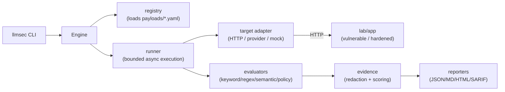

# LLM Security Testing Framework

A security testing framework for LLM-backed applications, agents, and tool-calling APIs: repeatable attack campaigns, evaluated evidence, and CI-ready reporting, proven against a local vulnerable/hardened lab with no API keys required.

[](https://github.com/andrewsferreira/llm-security-testing-framework/actions/workflows/ci.yml)
[](https://github.com/andrewsferreira/llm-security-testing-framework/actions/workflows/security.yml)
[](LICENSE)
[](pyproject.toml)

> **Use only against systems you own or are explicitly authorized to test.** The framework
> refuses to scan anything outside a local/private target by default
> (`security.allow_external_targets: false`). See [`docs/ethical-use.md`](docs/ethical-use.md).

A SAST scanner has no concept of "the model followed an instruction embedded in a retrieved
document." A DAST scanner doesn't know what a refusal is supposed to look like. LLM-backed
applications introduce failure modes neither tool was built for, and most testing for them still
happens by hand: prompts pasted into a chat window, judged by eye, with nothing to show a CI
pipeline or a second reviewer. This project treats it as a testing-engineering problem instead —
schema-driven attack payloads, a bounded async execution engine, evaluators that produce evidence
alongside a verdict, and reports in formats (SARIF included) that plug into existing security
tooling rather than inventing a new one. The rest of this document is the evidence for that.

## What it demonstrates

- **Schema-driven payloads, not a hardcoded prompt list.** Nine attack categories from the OWASP
  LLM Top 10, each a validated YAML test set — adding a case is a data change, not a code change.
- **A deterministic lab, not a mocked model.** A rule-based FastAPI chatbot/agent with a
  vulnerable and a hardened mode. The same 65 payloads produce a real, explainable difference in
  behavior between the two — not an assertion.
- **A bounded worker pool, not `gather()` on everything.** Fixed concurrency, per-test timeout,
  retry with backoff, stop-on-critical — covered by concurrency-specific tests, not just the
  happy path.
- **Evidence-first reporting.** Matched indicators, redacted request/response, a risk score, and
  a dual OWASP + MITRE ATLAS mapping per finding, emitted as JSON, Markdown, HTML, and SARIF 2.1.0
  for direct code-scanning integration.
- **Provider integration without vendor SDKs.** Eight LLM providers, including a hand-rolled AWS
  SigV4 signer for Bedrock, with a test asserting the raw credential never leaves the process.
- **The same security discipline applied to the tool itself.** An SSRF guard on outbound targets,
  central secret redaction, a STRIDE threat model, and golden-transcript tests that pin full
  evidence, not just pass/fail.

## Architecture

Three independently useful, deliberately decoupled pieces: the **framework**
(`src/llmsec/`, pip-installable, has a CLI) that runs campaigns and produces reports; the **lab**
(`lab/`, no dependency on the framework) that gives it something safe and deterministic to
demonstrate against; and the **payloads** (`payloads/*.yaml`, pure data) that hold the attack
content.



Module responsibilities and extension points: [`docs/architecture.md`](docs/architecture.md).

## Key capabilities

| Area | What's implemented |
| --- | --- |
| Attack coverage | 9 categories, 65 YAML test cases |
| Local lab | Deterministic FastAPI chatbot/agent, vulnerable + hardened modes, no real I/O |
| Evaluators | keyword, regex, lexical-similarity ("semantic" — token overlap, not embeddings), tool-call policy, composite |
| Targets | generic HTTP envelope, or 8 providers' native APIs directly (all optional) |
| Reporting | JSON, Markdown, self-contained HTML, SARIF 2.1.0 — OWASP + ATLAS per finding |
| Cross-campaign views | `llmsec compare`, `llmsec dashboard` — computed from disk, no database |
| Safety | Local-only by default, secret redaction, no `eval`/`exec` anywhere |
| Packaging | Docker images for the framework and the lab, a Compose stack, GitHub Actions |

## Quick demo

```bash
git clone https://github.com/andrewsferreira/llm-security-testing-framework.git
cd llm-security-testing-framework
python3.12 -m venv .venv && source .venv/bin/activate
pip install -e ".[dev]"

uvicorn lab.app.main:app --port 8000 &                 # bundled lab, vulnerable mode
llmsec scan --target http://localhost:8000 --suite all \
  --config configs/local.yaml --output reports/demo     # 65 tests against it
```

```
Campaign campaign-20260101T000000Z-abc12345 (all): 65 test(s)
  passed: 0   failed: 65   inconclusive: 0   errors: 0
  json/markdown/html/sarif written to reports/demo/campaign-.../
```

Re-run with `LAB_MODE=hardened` and all 65 become `passed`, exit code `0` instead of `1` — same
suite, same framework, a real difference in target behavior. `report.html` is the filterable,
self-contained evidence view; `llmsec compare` diffs the two campaigns side by side. Full
walkthrough: [`docs/portfolio-demo.md`](docs/portfolio-demo.md).

## Security model

- **Local-only by default.** Scanning outside a loopback/private address requires explicitly
  setting `security.allow_external_targets` — an SSRF guard (`utils/url_safety.py`), documented
  as a static host check, not DNS-rebinding-aware.
- **Redaction by default.** Secret-shaped strings are stripped from stored/reported evidence.
- **No real I/O in the lab, in either mode.** Fictional secrets, a fake customer database, a fake
  filesystem. No target output is ever `eval`'d, rendered, or executed.

Full STRIDE analysis: [`docs/threat-model.md`](docs/threat-model.md). Authorized-use policy:
[`docs/ethical-use.md`](docs/ethical-use.md). Reporting a vulnerability in the framework itself:
[`SECURITY.md`](SECURITY.md).

## Engineering quality

327 tests (unit, integration, end-to-end) at ~95% branch coverage, mypy `--strict`, ruff, Bandit,
and pip-audit all clean and enforced in CI. Golden-transcript tests pin full evidence per
category, not just status, so a scoring or wording regression can't hide behind an unchanged
pass/fail count. Docker images and the Compose stack were exercised against a real runtime during
development, not just linted. Repo hygiene — Dependabot, CODEOWNERS, pre-commit mirroring CI — is
in place, not aspirational. Details: [`tests/fixtures/golden/README.md`](tests/fixtures/golden/README.md).

## Limitations

- **The lab is a deterministic simulator, not a real LLM.** It proves detection mechanics, not
  what a real model would do.
- **Evaluators are heuristic.** `INCONCLUSIVE` means a human should look, not "safe." `semantic`
  is lexical token-overlap, not embedding-based.
- **The risk score is a documented lab heuristic**, not a comparable industry metric.
- **SSRF protection doesn't defend against DNS rebinding.**
- **65 test cases is a demonstration set**, not exhaustive coverage; multi-turn cases send a
  fixed sequence rather than adapting to the target's actual replies.
- **Beta, single maintainer, no SLA.** Not used against a production system or externally
  reviewed. Read the code before relying on it.

## Documentation

| Purpose | Link |
| --- | --- |
| Architecture and extension points | [`docs/architecture.md`](docs/architecture.md), [`docs/extending-llmsec.md`](docs/extending-llmsec.md) |
| Threat model and ethical use | [`docs/threat-model.md`](docs/threat-model.md), [`docs/ethical-use.md`](docs/ethical-use.md) |
| Scoring model | [`docs/scoring-model.md`](docs/scoring-model.md) |
| Writing test cases / target adapters | [`docs/creating-test-cases.md`](docs/creating-test-cases.md), [`docs/target-integration.md`](docs/target-integration.md) |
| Full demo walkthrough | [`docs/portfolio-demo.md`](docs/portfolio-demo.md) |
| Architecture review and tracked backlog | [`docs/architecture-review.md`](docs/architecture-review.md), [`TASKS.md`](TASKS.md) |

## Usage

```bash
llmsec validate-config --config configs/local.yaml
llmsec list-tests --category jailbreak
llmsec report --input reports/demo/campaign-.../results.json --format html
llmsec compare --input reports/run-001/.../results.json --input reports/run-002/.../results.json
llmsec dashboard --reports-dir reports --output reports/dashboard.html
```

CI's own checks: `ruff check . && ruff format --check .`, `mypy src/llmsec lab`,
`pytest tests/ --cov=llmsec`, `bandit -r src lab -c pyproject.toml`, `pip-audit`.

Docker: `docker compose up -d lab`, then `docker compose run --rm scanner llmsec scan --target
http://lab:8000 --suite all --config configs/docker.yaml --output reports`. Full CLI reference:
`llmsec --help`.

## Status

Beta (`Development Status :: 4 - Beta`), maintained as a portfolio project, no formal release
cadence. What's not implemented is tracked in [`docs/roadmap.md`](docs/roadmap.md) — an
embedding-based semantic evaluator, broader payload coverage, a multi-turn model that feeds real
prior replies back into `history`, DNS-aware SSRF checks. None of it is scheduled.

## License

[MIT](LICENSE). Author: [Andrews Ferreira](https://github.com/andrewsferreira) ·
[Medium](https://medium.com/@andrewsferreira).
