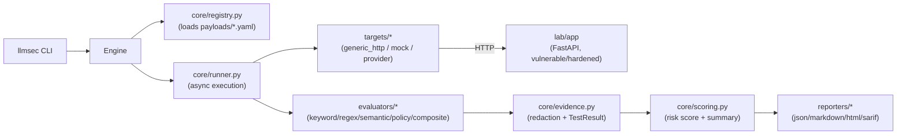

# Architecture

## Overview

llmsec is split into three independently useful pieces:

1. **The framework** (`src/llmsec/`) — a pip-installable Python package with a CLI (`llmsec`)
   that loads test cases, runs them against a target, evaluates the responses, and produces
   reports. It has no dependency on the lab.
2. **The lab** (`lab/`) — a standalone FastAPI application that simulates a vulnerable and a
   hardened LLM-backed chatbot/agent. It has no dependency on the framework. It exists purely
   so the framework has a safe, deterministic, fully local target to demonstrate against.
3. **The payloads** (`payloads/*.yaml`) — the actual security test cases, as data, not code.
   Almost none of the "attack logic" lives in Python; it lives in YAML, validated against a
   Pydantic schema and interpreted generically by the engine.

## Why this split

Keeping the lab and the framework independent means:

- The framework can be pointed at **any** HTTP-based chat/agent API, not just the bundled lab.
- The lab can be run and poked at on its own (`uvicorn lab.app.main:app`) without installing
  the framework at all — useful when developing new attack payloads.
- Neither side needs to know about the other's internals. The framework only needs the lab (or
  any target) to speak a simple JSON envelope; see `docs/target-integration.md`.

## Package layout (`src/llmsec/`)

| Module | Responsibility |
| --- | --- |
| `cli.py` | Typer CLI: `scan`, `list-tests`, `validate-config`, `report`, `version` |
| `config.py` | Loads and validates `configs/*.yaml` into a `Config` model; enforces the SSRF/local-target gate at load time |
| `models/` | Pydantic models: `TestCase`, `TestResult`, `TargetConfig`, `Campaign` |
| `core/registry.py` | Discovers and validates `TestCase` objects from a directory of YAML files; resolves `--suite` names/aliases to categories |
| `core/runner.py` | Bounded-concurrency async execution: timeout, retry, rate limit, stop-on-critical |
| `core/evidence.py` | Builds a `TestResult` from a `TestCase` + response + evaluator outcome, applying redaction |
| `core/scoring.py` | Risk scoring and campaign-level summarization |
| `core/engine.py` | Orchestrates the above into `llmsec scan` and `llmsec report` |
| `attacks/` | Reference metadata (title, description, OWASP LLM Top 10 mapping) per category — not executable logic |
| `evaluators/` | Pluggable verdict logic: `keyword`, `regex`, `semantic`, `policy`, `composite` |
| `targets/` | `generic_http` (any HTTP target), `mock_target` (in-process, for fast tests), `provider_adapter` (optional, direct OpenAI/Anthropic-style APIs) |
| `reporters/` | Renders a `Campaign` + its summary into JSON/Markdown/HTML/SARIF |
| `utils/` | Redaction, retry, identifiers, serialization, URL safety — small, dependency-free helpers |

## Execution flow (`llmsec scan`)

1. `config.load_config` reads and validates the YAML config (target, campaign tuning,
   reporting formats, security flags), rejecting non-local targets unless
   `security.allow_external_targets: true`.
2. `core.registry.load_all_test_cases` + `select_suite` load and filter the payload YAML files.
3. `targets.build_target` constructs the right `Target` implementation for `target.type`.
4. `core.runner.run_campaign_async` runs every test case through a bounded worker pool: each
   worker pulls a `TestCase`, sends it to the target (single request, or a sequence of requests
   for `requires_multi_turn` cases), retries on transient failure, and enforces a per-test
   timeout.
5. For each response, the evaluator named in `test_case.evaluator_config["type"]` produces an
   `EvaluationOutcome` (passed/failed/inconclusive/error + confidence + evidence).
6. `core.evidence.build_result` turns that into a `TestResult`, redacting request/response
   content and computing a risk score for FAILED results.
7. `core.scoring.summarize` aggregates the campaign into a `CampaignSummary` (counts,
   severity/category distributions, sorted findings, deduped remediations).
8. `reporters.write_reports` renders every configured format to `reports/<campaign-id>/`.
9. The CLI exits `0` if there were no findings, `1` if there were, `2` for usage errors, `3` for
   target errors (see `constants.ExitCode`).

## Concurrency model

`core/runner.py` uses a plain `asyncio.Queue` of test cases drained by
`campaign.max_concurrency` worker coroutines, not a semaphore wrapping `asyncio.gather` over
everything at once — this keeps memory bounded regardless of suite size and makes
stop-on-critical straightforward: a shared `asyncio.Event` is checked before each worker
dequeues its next item, so in-flight requests are allowed to finish but no new ones start once
a CRITICAL finding is confirmed.

## Adding a new target

Implement the `Target` protocol in `targets/base.py` (one async method, `send`) and register it
in `targets/build_target`. See `docs/target-integration.md` for the generic HTTP envelope most
targets can use without writing any new code at all.

## Adding a new evaluator

Implement `evaluators/base.py`'s `Evaluator` protocol and call `register_evaluator("name", ...)`
in `evaluators/__init__.py`. See `docs/creating-test-cases.md` for the `evaluator_config` shape
each built-in evaluator expects.
