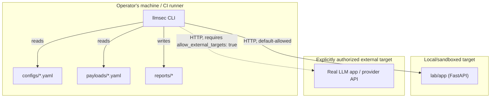

# Threat Model

This is a threat model for the llmsec framework itself, the bundled lab, and the way they're
typically deployed together — not a threat model of "LLM applications in general" (that's what
the framework *tests for*, via the 9 attack suites). It uses STRIDE as its structure.

## Scope

**In scope:**
- The llmsec scanner (CLI, engine, targets, evaluators, reporters) running locally or in CI.
- The bundled lab (`lab/app`), run standalone or via Docker/Compose.
- Configuration files (`configs/*.yaml`), payload files (`payloads/*.yaml`), and generated
  reports (`reports/`).
- The optional provider adapter (`targets/provider_adapter.py`) and any API key it uses.

**Out of scope:**
- The security of a *real* third-party LLM application under test — that's the subject of the
  scan, not of this document. If you point llmsec at a production system, that system's own
  threat model is yours to own, and you need explicit authorization to test it (see
  `docs/ethical-use.md`).
- Supply-chain security of upstream dependencies (FastAPI, httpx, pydantic, etc.) beyond running
  `pip-audit` in CI.

## Assets

| Asset | Why it matters |
| --- | --- |
| The scanning operator's authorization/credentials for the real target | Misuse could mean testing a system without permission |
| Provider API keys (`OPENAI_API_KEY` / `ANTHROPIC_API_KEY`), if configured | Real secrets, real cost, real quota |
| Scan results (`reports/*`) | May contain redacted-but-still-sensitive excerpts of a real target's behavior |
| The lab's fictional secrets (`SYSTEM_SECRET_MARKER_7F3A`, etc.) | Not sensitive themselves, but their *leakage in a report* is the signal the whole framework is built to detect |
| The host machine running the scanner/lab | Standard host security applies; Docker containers run as non-root (see `Dockerfile`, `lab/Dockerfile`) |

## Trust boundaries

The load-bearing boundary is the one between "CLI" and "target": by default (
`security.allow_external_targets: false`), the CLI will only talk to `localhost` or a literal
private/loopback IP. Crossing into `ExternalTarget` requires an explicit, deliberate
configuration change — that's the whole point of the SSRF/authorization guard in
`utils/url_safety.py`.

## Threat actors

- **A careless or rushed operator** who points the scanner at the wrong host, or leaves
  `allow_external_targets: true` set from a previous session. Mitigated by the default-deny
  posture and by `validate-config` surfacing the target before anything runs.
- **A malicious target** — if a user points llmsec at an untrusted or compromised endpoint, that
  endpoint could try to abuse the scanner (see STRIDE entries below).
- **A malicious payload file** contributed by someone else (e.g., a PR) — since `evaluator_config`
  and prompts are just YAML data, a poisoned payload can't execute code, but it can shape what
  gets sent to a target.
- **Not modeled as a threat actor:** the lab itself. It is intentionally "vulnerable" by design in
  one of its two modes; every action it can take is fully simulated (see `lab/README.md`), so
  there's no real payload for an attacker to actually exfiltrate or execute even if the lab's
  vulnerable-mode behavior were somehow triggered by something other than the scanner.

## STRIDE analysis

### Spoofing
- **Threat:** A target impersonates a different, more-trusted target to get a weaker security
  posture applied (e.g., claiming to be `localhost`).
- **Mitigation:** `allow_external_targets` is evaluated against the *configured* `base_url`
  string, not anything the target claims about itself. TLS verification is on by default via
  httpx (no custom verification bypass anywhere in the codebase).
- **Residual risk:** DNS rebinding — a hostname that resolves to a private IP at config-check
  time but a different IP at request time (or vice versa) is not fully defended against; see
  "Known limitations" below.

### Tampering
- **Threat:** A malicious target modifies its responses to feed the scanner false evidence, or a
  malicious payload file tampers with what gets sent.
- **Mitigation:** Responses are size-capped (`MAX_RESPONSE_BYTES`) and redirect-capped
  (`MAX_HTTP_REDIRECTS`) before being parsed. Payload files are Pydantic-validated, so a
  malformed/tampered file fails closed (`RegistryError`) rather than silently running something
  unexpected.
- **Residual risk:** A target can still return misleading *content* within those caps — the
  evaluators are heuristic, not a guarantee of ground truth (see `docs/scoring-model.md`).

### Repudiation
- **Threat:** No record of what was actually tested, when, or by whom.
- **Mitigation:** Every campaign gets a unique, timestamped ID; results are written to disk
  with request/response evidence (redacted) and timestamps; structured JSON logs include
  `campaign_id`/`test_id`/`status`/`latency`.

### Information Disclosure
- **Threat:** A report leaks a real secret (a real API key, real PII) captured from a real
  target's response.
- **Mitigation:** `security.redact_sensitive_values` (on by default) passes every stored
  request/response through `utils/redaction.py` before it's kept in memory or written anywhere —
  this strips generic secret-shaped strings (bearer tokens, emails, `sk-`-style keys, long
  opaque tokens) in addition to each test case's own `failure_indicators`.
- **Residual risk:** Redaction is pattern-based, not perfect; a secret that doesn't match any
  known shape could slip through. Treat `reports/` as sensitive regardless.

### Denial of Service
- **Threat:** A campaign overwhelms a target, or a slow/hanging target ties up the scanner
  indefinitely.
- **Mitigation:** `campaign.max_concurrency` bounds parallel requests; `test_case.timeout` bounds
  how long any single request can hang; `campaign.rate_limit_per_second` can throttle further;
  `campaign.retry_count`/`retry_backoff_seconds` bound retry storms.
- **Residual risk:** llmsec has no built-in awareness of a target's own rate limits beyond what
  you configure — be conservative against anything you don't own.

### Elevation of Privilege
- **Threat:** The scanner or lab is tricked into executing something beyond "send an HTTP
  request and read the response."
- **Mitigation:** No `eval`/`exec`/`pickle` anywhere in the codebase. No model/tool output is
  ever executed as code or shell commands — `insecure_output_handling` test cases *detect*
  dangerous-looking output, they never run it. The lab's simulated tools (`lab/app/tools.py`)
  perform no real file, network, or email I/O regardless of mode.

## Configuration and credential handling

- `.env.example` documents every environment variable; no real credentials are ever committed.
- `auth_token_env` in `TargetConfig` names an environment variable to read a token from — the
  token itself is never written into a config file.
- The optional `targets/provider_adapter.py` requires both `security.allow_external_targets:
  true` *and* the named env var to be set; it fails closed (`TargetError`) if either is missing.

## Known limitations

- **SSRF protection is best-effort, not exhaustive.** `utils/url_safety.py` performs a static
  check of the URL's literal scheme/host at validation time. It does not resolve DNS, so it
  cannot detect a hostname that resolves to a private/internal address only *after* the check
  runs (DNS rebinding), and it does not re-validate the final destination of an HTTP redirect
  beyond capping how many are followed.
- **Evaluators are heuristic**, not formal verification — see `docs/scoring-model.md`.
- **The lab is a rule-based simulator**, not a real LLM — see `docs/creating-test-cases.md` for
  what that does and doesn't demonstrate.
- **Redaction is pattern-based** and can't guarantee every possible secret shape is caught.

## Assumptions

- The operator running llmsec has legitimate authorization to test whatever target they point it
  at (see `docs/ethical-use.md`) — the framework enforces a *local-by-default* posture, not
  authorization itself, which it has no way to verify.
- The machine running llmsec is otherwise reasonably secured (OS updates, no already-compromised
  local processes able to tamper with `reports/` or `configs/`).
